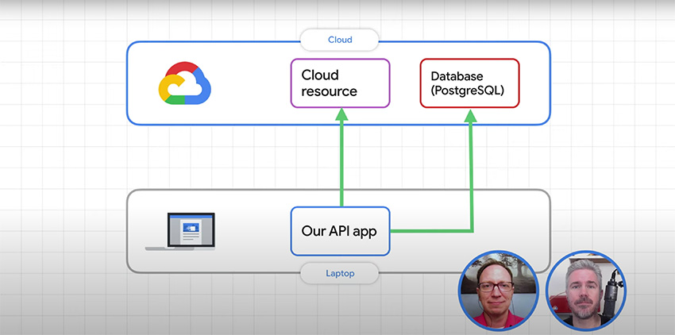

# Local development with Cloud Run - Serverless Toolbox

Slow internet interrupting your ability to develop your applications? In this episode of Serverless Toolbox Extended, we show you how to write and debug your app locally while still accessing a Cloud API and a Cloud SQL Postgresql database. Then we'll deploy everything to Google Cloud using Cloud Run.

## Serverless Toolbox Extended episode
[](https://www.youtube.com/watch?v=bSRpcAKAN3E&list=PLIivdWyY5sqKiWvnaA5A8F3UQ0Xu5i49U)

View the episode on YouTube: [Cloud Run local development - Serverless Toolbox Extended](https://www.youtube.com/watch?v=bSRpcAKAN3E&list=PLIivdWyY5sqKiWvnaA5A8F3UQ0Xu5i49U)

## Database setup
Setup commands are in `db_setup.sql`. This will create the table, insert
test records and create a user account for your API.

```shell
psql postgres -f db_setup.sql
```

## Running the app
### Set environment variables before running
```shell
export DB_USER=rest-api
export DB_PASS=serverlesst00lb0x
export DB_NAME=marketing
export DB_HOST=localhost
npm install
node index.js
```

## Cloud SQL database
### Connect local app to Cloud SQL database in Google Cloud
1. Review [Quickstart for using the proxy for local testing](https://cloud.google.com/sql/docs/postgres/quickstart-proxy-test).
2. Enable the [Cloud SQL Admin API](https://console.cloud.google.com/apis/library/sqladmin.googleapis.com).
3. Download the Cloud SQL Proxy client and run it:
```shell
./cloud_sql_proxy -instances=<INSTANCE_CONNECTION_NAME>=tcp:5432
```
`INSTANCE_CONNECTION_NAME` is something like `clever-goldfish-test:us-central1:goldfish-db`.

------------------

[](https://www.serverlesstoolbox.com)
